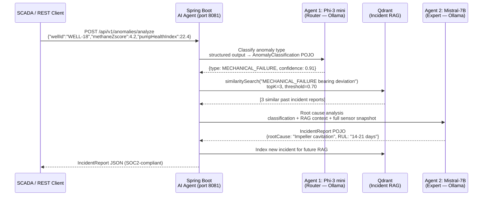

# WellStream

> Real-time well and tank safety monitoring, emission compliance, and ML-driven pump failure prediction — built on Kafka, Spark Structured Streaming, and Redis.

[](https://github.com/Krishna2592/wellstream/actions/workflows/ci.yml) [](https://github.com/Krishna2592/wellstream/actions/workflows/docker.yml) [](https://github.com/Krishna2592/wellstream/actions/workflows/security-scan.yml)

  -black)   

---

## Why I Built This

Unplanned downtime on a producing well costs anywhere from tens to hundreds of thousands of dollars per day. Most of it is avoidable. The data is there — pressure, temperature, flow rate, vibration — streaming off sensors continuously. The problem is that by the time it hits a morning report, the bearing has already failed or the methane reading has been in violation for six hours.

This project is my attempt to build the kind of pipeline that should sit between the sensor and the operator: one that processes telemetry in real time, classifies risk against regulatory thresholds, scores pump health against physics-based models, and — for the failure mode where it actually makes sense — uses time-series regression to tell you not just *that* a bearing is degrading, but *when* it will reach the critical threshold.

Everything runs on the open-source stack that production O&G data platforms actually use. No black-box ML frameworks. No vendor lock-in. Just Kafka, Spark, and enough domain knowledge baked into the models to make the outputs meaningful to a field engineer.

---

## What It Does

Two streaming pipelines run concurrently on the same Kafka topics:

**Pipeline 1 — Facility Safety Monitor** (5-second trigger)
Joins well and tank telemetry at the facility level, classifies methane and vapor risk against EPA/OSHA thresholds, computes Z-score anomaly detection across sensor streams, and caches facility health payloads to Redis for SCADA dashboard consumption.

**Pipeline 2 — Pump Health & RUL Predictor** (10-second trigger)
Runs on well telemetry only. Computes deviation from pump curve Best Efficiency Point (BEP), scores a weighted Pump Health Index (PHI) across flow, pressure, thermal, and vibration signals, diagnoses one of six mechanical failure modes, and — for bearing failures — fits a `LinearRegression` model on the PHI time-series to extrapolate a quantitative Remaining Useful Life (RUL) with R² confidence.

---

## Architecture

```
                        ┌─────────────────────────────────┐
  Well Sensors (IoT) ──►│                                 │
  Tank Sensors (IoT) ──►│   Apache Kafka  (3 partitions)  │◄── Avro + Schema Registry
                        │   well-sensor-data              │
                        │   tank-sensor-data              │
                        └──────────────┬──────────────────┘
                                       │
                    ┌──────────────────┴──────────────────┐
                    │                                     │
          ┌─────────▼──────────┐               ┌─────────▼──────────┐
          │  PIPELINE 1        │               │  PIPELINE 2        │
          │  Facility Safety   │               │  Pump Health       │
          │  5-second trigger  │               │  10-second trigger │
          │                    │               │                    │
          │  Steps 3–13:       │               │  BEP deviation     │
          │  Avro deserialize  │               │  PHI scoring       │
          │  Emission classify │               │  Failure mode Dx   │
          │  Stream-stream join│               │  ML RUL (bearing)  │
          │  Z-score anomaly   │               │  L1–L4 alarms      │
          │  VectorAssembler   │               │                    │
          └─────────┬──────────┘               └─────────┬──────────┘
                    │                                     │
                    └──────────────┬──────────────────────┘
                                   │
                    ┌──────────────▼──────────────────────┐
                    │           Redis Cache               │
                    │  facility:{id}:health  (5-min TTL) │
                    │  pump:{well_id}:alarm  (10-min TTL)│
                    │  pump:rul:bearing:{id} (time-series)│
                    └──────────────┬──────────────────────┘
                                   │
              ┌────────────────────┼────────────────────┐
              │                    │                    │
     ┌────────▼───────┐   ┌────────▼───────┐  ┌────────▼───────┐
     │  SCADA/Grafana │   │   ksqlDB       │  │  Prometheus    │
     │  Dashboards    │   │  EPA streams   │  │  Pipeline      │
     │  (hot-path     │   │  LDAR tables   │  │  Observability │
     │   Redis reads) │   │                │  │                │
     └────────────────┘   └────────────────┘  └────────────────┘
```

| Component | Technology | Role |
|---|---|---|
| Message broker | Apache Kafka 7.4 | Ordered, durable sensor telemetry ingestion |
| Schema enforcement | Confluent Schema Registry | Avro schema versioning and backward compatibility |
| Stream processing | Apache Spark 3.5 Structured Streaming | Both pipelines — SQL classification, windowed joins, foreachBatch |
| ML feature engineering | Spark MLlib VectorAssembler | Multi-sensor feature vectors for anomaly scoring |
| ML regression | Spark MLlib LinearRegression | PHI time-series regression → quantitative RUL for bearing failures |
| Stream analytics | ksqlDB | EPA exceedance alert streams, hourly LDAR compliance tables |
| Health cache | Redis Alpine | Facility and pump alarm payloads, PHI time-series history |
| Observability | Prometheus + Grafana | Pipeline throughput, batch latency, Kafka consumer lag |
| Orchestration | Docker Compose / Kubernetes | Local development and production deployment |
| Language | Java 11 / Maven 3.9 | Application runtime and build |

---

## Pipeline 1 — Facility Safety Monitor

Processes both well and tank telemetry through 13 transformation steps to produce a real-time, facility-level safety view.

```
STEP 1–2   Kafka topics created (well-sensor-data, tank-sensor-data)
           Avro schemas registered in Confluent Schema Registry
                │
STEP 3     Spark Session initialized
           checkpointLocation=/tmp/checkpoint, AQE enabled
                │
STEP 4     Streaming DataFrames created from Kafka
           well stream: readStream.format("kafka").subscribe("well-sensor-data")
           tank stream: readStream.format("kafka").subscribe("tank-sensor-data")
                │
STEP 5–6   Avro deserialization via from_avro()
           Temp views registered: well_data_temp, tank_data_temp
                │
STEP 7     Spark SQL emission and vapor risk classification
           Methane:  >500 ppm → HIGH_EMISSION   (EPA Method 21 leak threshold)
                     >100 ppm → MEDIUM_EMISSION
           Vapor:    >10,000 ppm → CRITICAL      (OSHA PSM threshold)
                     >5,000 ppm  → HIGH
                │
STEP 8     Base64 vibration telemetry decoded via registered UDF
                │
STEP 9     Null filter + data quality scoring (70–95 range)
           Watermark: 10 seconds on event_timestamp
                │
STEP 10    Stream–stream inner join on facility_id + ±1-minute time window
           Produces facility-level view: well metrics correlated with tank metrics
           Correlation score drives facility_status (NORMAL / WARNING / CRITICAL_ALERT)
                │
STEP 11    foreachBatch — Spark MLlib VectorAssembler
           Features: [methane_ppm, co2_ppm, vapor_concentration_ppm, level_percentage]
           → sensor_features vector (ready for isolation forest or clustering)
                │
STEP 12    Z-score anomaly detection on methane_ppm (batch-relative)
           methane_zscore = (methane_ppm − batch_mean) / batch_stddev
           predictive_maintenance_score (0–100): emission + vapor + level-extreme signals
           is_anomaly = |zscore| > 2.0 OR risk_score > 60
                │
STEP 13    Anomalous facility payloads → Redis
           Key: facility:{id}:health  TTL: 300s
           {"risk_score":80,"status":"CRITICAL_ALERT","methane_zscore":2.91,
            "predictive_maintenance_score":80,"anomaly":true}
```

---

## Pipeline 2 — Pump Health & RUL Predictor

Runs independently on the well sensor stream. Only evaluates pumps with `pump_status = active`.

### Pump Health Index (PHI)

A centrifugal pump operating at its Best Efficiency Point (BEP) has minimum hydraulic radial forces, heat generation, and wear. Deviation from BEP is the root cause of most mechanical failure modes. PHI captures that deviation across four weighted signals:

| Signal | Weight | What it measures |
|---|---|---|
| Flow deviation from BEP | 40% | Impeller and seal degradation — first signal to shift |
| Pressure deviation from rated head | 30% | Restriction (scale/wax) vs impeller damage (opposite directions) |
| Temperature rise above design | 20% | Bearing and motor failure — leads mechanical failure by days |
| Vibration severity (ISO 10816-7 zones) | 10% | Cavitation, imbalance, misalignment — confirmatory |

PHI ranges 0–100. Thresholds: **75** (healthy) → **50** (degrading) → **25** (critical).

### Failure Mode Diagnosis

Six patterns, each mapping to a distinct physical failure mechanism:

| Mode | Signal pattern | Physical cause | Field action |
|---|---|---|---|
| `SCALE_WAX_BUILDUP` | ↓ flow + ↑ pressure | Restriction forming downstream | Hot-oil flush or mechanical pigging |
| `IMPELLER_WEAR` | ↓ flow + ↓ pressure | Impeller losing geometry | Pull well, replace impeller stack |
| `BEARING_FAILURE_RISK` | ↑ temperature + ↑ vibration | Worn or misaligned bearing | Bearing replacement, check alignment |
| `SEAL_DEGRADATION` | ↑ temperature, stable flow/pressure | Mechanical seal faces wearing | Inspect seal, review flush plan |
| `GAS_INTERFERENCE_CAVITATION` | High methane + ↓ flow | GVF >15% causing cavitation | Increase casing pressure, install separator |
| `MECHANICAL_IMBALANCE_CAVITATION` | ↑ vibration, normal temperature | Rotor imbalance or inlet cavitation | FFT vibration analysis, check suction head |

### ML-Based RUL for Bearing Failures (`BearingRulPredictor`)

Bearing degradation is the one failure mode that degrades monotonically and linearly in the early-to-mid stages — thermal load rises steadily as bearing clearance increases. That predictability makes it the right candidate for time-series regression.

Every batch, PHI is recorded to a per-well Redis list (`pump:rul:bearing:{well_id}`). Once 5 readings accumulate, `BearingRulPredictor` fits a Spark MLlib `LinearRegression` on the PHI history and extrapolates when PHI will reach the critical threshold (25.0):

```
PHI(t) = slope × t + intercept

t_critical = (25.0 − intercept) / slope
RUL        = t_critical − t_now
```

The output includes the slope (PHI/hr), R², and sample count so the consumer knows how reliable the estimate is:

```
~11.3 hrs to critical (LinearRegression: slope=-2.841 PHI/hr, R²=0.96, n=8)
```

For all other failure modes, qualitative RUL is used — those modes are abrupt or non-linear, and a regression line would be misleading.

The `rul_method` field in the Redis alarm payload (`linear_regression` vs `rule_based`) makes the distinction explicit.

### Alarm Levels (API 610 / ISO 13709)

| Level | Condition | Response time | Action |
|---|---|---|---|
| `L4_SHUTDOWN` | Vibration in ISO zone D, or PHI critical + confirmed fault | Immediate | Shut down, pull well, full inspection |
| `L3_CRITICAL` | PHI < 25, temp rise >45°F, or bearing/seal alarm | 4 hours | Dispatch field team, prepare workover |
| `L2_WARNING` | PHI < 50, vibration in zone C, or structural failure mode | 24 hours | Schedule inspection, run vibration survey |
| `L1_ADVISORY` | PHI < 75, early degradation signals | Next maintenance window | Log in CMMS |

---

## Quick Start

### Prerequisites

- **Docker Desktop** — allocate at least **4 GB RAM** (Spark + Kafka need headroom)
- **Java 11** and **Maven 3.9+**
- Ports available: `9092`, `8081`, `8088`, `6379`, `4040`, `3000`, `9090`

---

### Step 1 — Build

```bash
mvn clean package -DskipTests
```

Both modules build to fat JARs. `BUILD SUCCESS` on both.

---

### Step 2 — Start the stack

```bash
docker compose up -d
```

Startup order (managed by `depends_on`): Zookeeper → Kafka → `kafka-init` (topic creation) → Schema Registry → ksqlDB → Redis → Producer → Spark Processor.

Wait ~30 seconds for Kafka to complete leader election.

```bash
docker compose ps
# All services: running
# kafka-init: exited (0) — correct, it's a one-shot job
```

---

### Step 3 — Watch Pipeline 1 (facility safety)

```bash
docker logs -f wellstream-spark
```

Boot sequence:

```
>>> STEP 3: Initializing Spark Session...
>>> STEP 4: Creating streaming DataFrames from Kafka...
>>> STEP 7: Executing SQL queries for emission risk classification...
>>> STEP 10: Joining well and tank telemetry by facility...
>>> STEP 11-13: Starting foreachBatch pipeline (anomaly detection + Redis)...
✓ STEP 11-13 COMPLETE: Facility safety pipeline active
>>> PUMP HEALTH: Starting pump failure prediction pipeline...
✓ Pump health monitoring pipeline active (10-second trigger)
```

Every 5 seconds — facility safety batch:

```
-------------------------------------------
Batch: 4
-------------------------------------------
+--------+-----------+-----------+-------------------+----------+--------------+-----------+
|well_id |facility_id|methane_ppm|emission_risk_level|risk_score|methane_zscore|is_anomaly |
+--------+-----------+-----------+-------------------+----------+--------------+-----------+
|WELL-18 |FAC-8      |678.23     |HIGH_EMISSION      |80        |2.91          |true       |
|WELL-4  |FAC-4      |213.50     |MEDIUM_EMISSION    |30        |0.42          |false      |
|WELL-11 |FAC-1      |89.10      |NORMAL             |20        |-1.21         |false      |
```

```
  [ANOMALY] FAC-8 → risk=80  z=2.91  mx_score=80  → cached in Redis
```

---

### Step 4 — Watch Pipeline 2 (pump health)

Same terminal, interleaved every 10 seconds. Once a well accumulates 5 PHI readings (~50 seconds), the ML RUL prediction appears:

```
  ┌─ ML RUL — Bearing Failure — LinearRegression on PHI history (batch 8) ─┐
  │  WELL-18    →  ~11.3 hrs to critical (LinearRegression: slope=-2.841 PHI/hr, R²=0.96, n=8)
  └──────────────────────────────────────────────────────────────────────────┘

  [PUMP L3_CRITICAL    ] WELL-18  PHI= 22.4  mode=BEARING_FAILURE_RISK
                   RUL: ~11.3 hrs to critical (LinearRegression: slope=-2.841 PHI/hr, R²=0.96, n=8)
                   action: Dispatch field team within 4h — confirm failure mode, prepare workover

=== PUMP HEALTH SUMMARY — Batch 8 ===
+--------+-----------+-----------------+---------------+--------------------+------------+------------------+
|well_id |pump_status|pump_health_index|pump_alarm_level|failure_mode       |rul_estimate|hydraulic_eff_pct |
+--------+-----------+-----------------+---------------+--------------------+------------+------------------+
|WELL-18 |active     |22.4             |L3_CRITICAL    |BEARING_FAILURE_RISK|~11.3 hrs  |84.3              |
|WELL-7  |active     |43.1             |L2_WARNING     |IMPELLER_WEAR       |14–90 days  |59.4              |
|WELL-3  |active     |91.2             |NORMAL         |NO_FAULT_DETECTED   |90+ days    |98.6              |
```

**Column reference:**
- `pump_health_index` — 0–100. >75 healthy, 50–75 degrading, 25–50 warning, <25 critical
- `hydraulic_efficiency_pct` — actual Q×H vs design Q×H. Below 70% = significant degradation
- `flow_deviation_pct` — % from pump BEP. Negative = reduced throughput
- `rul_estimate` — ML-predicted (bearing failures) or qualitative (all other modes)

---

### Step 5 — Check Redis

Facility health (Pipeline 1):

```bash
docker exec -it redis redis-cli KEYS "facility:*:health"
docker exec -it redis redis-cli GET "facility:FAC-8:health"
```

```json
{"risk_score":80,"status":"CRITICAL_ALERT","methane_zscore":2.91,"predictive_maintenance_score":80,"anomaly":true,"batch_id":7}
```

Pump alarms (Pipeline 2):

```bash
docker exec -it redis redis-cli KEYS "pump:*:alarm"
docker exec -it redis redis-cli GET "pump:WELL-18:alarm"
```

```json
{"alarm":"L3_CRITICAL","failure_mode":"BEARING_FAILURE_RISK","phi":22.4,
 "rul":"~11.3 hrs to critical (LinearRegression: slope=-2.841 PHI/hr, R²=0.96, n=8)",
 "rul_method":"linear_regression","flow_dev":-8.2,"pres_dev":3.1,"temp_rise":38.5,"batch":8}
```

PHI time-series (raw history behind the ML model):

```bash
docker exec -it redis redis-cli LRANGE "pump:rul:bearing:WELL-18" 0 -1
```

---

### Step 6 — EPA compliance streams in ksqlDB

```bash
docker exec -it ksqldb-cli ksql http://ksqldb-server:8088
```

```sql
RUN SCRIPT '/ksql-scripts/create-streams.sql';
RUN SCRIPT '/ksql-scripts/create-tables.sql';

-- Watch EPA Method 21 exceedances live
SELECT well_id, facility_id, methane_ppm, regulation_code, detected_at
FROM epa_exceedance_alerts EMIT CHANGES;

-- Hourly LDAR aggregates
SELECT well_id, hour_start, avg_methane_ppm, peak_methane_ppm, total_readings
FROM ldar_hourly_compliance;
```

---

### Step 7 — Spark UI

**http://localhost:4040**

- **Streaming** tab — input rate, processing time, batch duration for both queries
- **SQL** tab — physical plan for the stream–stream join (watermark state management)
- **Jobs** tab — each micro-batch as a completed Spark job

---

### Step 8 — Monitoring (Prometheus + Grafana)

```bash
docker compose -f docker-compose.yml -f docker-compose.monitoring.yml up -d
```

| Service | URL | Credentials |
|---|---|---|
| Grafana | http://localhost:3000 | admin / admin |
| Prometheus | http://localhost:9090 | — |
| Kafka exporter metrics | http://localhost:9308/metrics | — |
| Redis exporter metrics | http://localhost:9121/metrics | — |

Add Prometheus as a Grafana data source (`http://prometheus:9090`) and query:
- `kafka_topic_partition_current_offset` — consumer lag
- `spark_streaming_lastCompletedBatch_processingDelay` — batch latency
- `redis_connected_clients` — cache connections

---

### Tear down

```bash
docker compose down        # stop, keep volumes
docker compose down -v     # stop, delete volumes (full reset)
```

---

### Running Locally (without Docker for Spark/Producer)

Useful for faster iteration — infrastructure in Docker, JVM processes running natively:

```bash
# Start infrastructure only
docker compose up -d zookeeper kafka kafka-init schema-registry ksqldb-server ksqldb-cli redis

# Terminal 2 — producer
cd producer
KAFKA_BOOTSTRAP_SERVERS=localhost:9092 \
SCHEMA_REGISTRY_URL=http://localhost:8081 \
REDIS_HOST=localhost \
mvn exec:java

# Terminal 3 — Spark processor
cd spark-processor
KAFKA_BOOTSTRAP_SERVERS=localhost:9092 \
REDIS_HOST=localhost \
mvn exec:java
```

---

### Kubernetes

```bash
kubectl apply -f k8s
kubectl logs -f deployment/spark-processor
kubectl get pods
```

See [k8s/README.md](k8s/README.md) for StatefulSet configuration and resource sizing.

---

## Project Structure

```
wellstream/
├── producer/
│   └── src/main/java/com/wellstream/streaming/
│       ├── FakeDataProducer.java     # Dual-threaded well + tank Avro producer with Jedis
│       ├── WellEvent.java            # Well sensor POJO
│       └── TankEvent.java            # Tank sensor POJO
├── spark-processor/
│   └── src/main/java/com/wellstream/streaming/
│       ├── RealTimeWellTankPipeline.java   # Main — Steps 3–13 + both streaming queries
│       ├── PumpHealthMonitor.java          # BEP deviation, PHI, failure mode Dx, alarm levels
│       └── BearingRulPredictor.java        # Redis time-series + LinearRegression RUL
├── ksql-scripts/
│   ├── create-streams.sql            # EPA exceedance alert stream, pump maintenance alerts
│   └── create-tables.sql             # LDAR hourly compliance, facility daily emissions
├── k8s/                              # Kubernetes manifests (StatefulSets, Deployments, Services)
├── monitoring/                       # Prometheus scrape config, Grafana dashboard notes
├── docs/
│   ├── ARCHITECTURE.md               # Detailed data flow and technology decisions
│   └── observability.md              # Grafana setup and alert rules
├── docker-compose.yml                # Full stack
├── docker-compose.monitoring.yml     # Prometheus + Grafana add-on
└── pom.xml                           # Parent POM (Java 11, Spark 3.5, Confluent 7.4)
```

---

## Regulatory Context

Emission thresholds and alarm levels are calibrated to U.S. federal regulations and industry standards:

| Signal | Threshold | Standard | Pipeline action |
|---|---|---|---|
| Methane (well) | > 500 ppm | EPA 40 CFR Part 60 Subpart OOOOa, Method 21 | `HIGH_EMISSION` classification, LDAR inspection trigger |
| Vapor concentration (tank) | > 10,000 ppm | OSHA 29 CFR 1910.119 (PSM Standard) | `CRITICAL` vapor risk, `CRITICAL_ALERT` facility status |
| Vapor concentration (tank) | > 5,000 ppm | Internal LDAR program trigger | `HIGH` vapor risk, elevated maintenance score |
| Tank fill level | < 10% or > 90% | API 650 / operator SOP | Seal stress flag, elevated PHI pressure component |
| Pump vibration | Zone C (0.45–0.71) | ISO 10816-7 | `L2_WARNING`, schedule vibration survey |
| Pump vibration | Zone D (> 0.71) | ISO 10816-7 | `L4_SHUTDOWN`, pull well |
| Pump bearing temp rise | > 45°F above design | API 610 Annex K | `L3_CRITICAL`, `BEARING_FAILURE_RISK` diagnosis |

KSQL emits `epa_exceedance_alerts` on every Method 21 breach. `ldar_hourly_compliance` and `facility_daily_emissions` support the federal record-keeping requirements under 40 CFR Part 60, Appendix A (2-year minimum retention).

---

## Why Streaming Over Batch

```
BATCH (nightly ETL):
  00:00  Sensors log readings to file
  01:00  Files transferred to data warehouse
  02:00  ETL job processes previous day
  03:00  HSE report generated, alerts sent
  Result: 3–4 hour latency

STREAMING (this pipeline):
  T+0ms   Sensor reading arrives in Kafka
  T+10ms  Spark receives micro-batch
  T+20ms  Avro deserialized, SQL classification runs
  T+30ms  Anomaly score, PHI, failure mode computed
  T+40ms  CRITICAL_ALERT written to Redis
  Result: 40ms end-to-end latency
```

The Lower Explosive Limit (LEL) of methane is 5% by volume (~50,000 ppm). A well crossing 500 ppm is 1% of LEL — early enough to isolate safely if detected immediately. A 4-hour batch cycle is not a monitoring system for that scenario.

The same logic applies to bearing failures. A bearing degrading at −2.8 PHI/hr has roughly 18 hours before it reaches critical. That window shrinks fast once the cascade starts. Streaming with a 10-minute Redis cache means a field engineer can see the RUL trend the moment it appears, not in the next day's maintenance report.

---

## Scaling Path

The local setup runs Kafka on 3 partitions and Spark in `local[*]` mode. The path to production scale is straightforward:

| Layer | Local | Production |
|---|---|---|
| Kafka partitions | 3 | 30+ (1 per Spark executor) |
| Spark execution | `local[*]` 4 cores | 50–100 executors on Kubernetes |
| Sink | Console | Delta Lake on S3/ADLS (ACID, time-travel) |
| Checkpoint | `/tmp` | S3 or HDFS |
| State backend | In-memory | RocksDB (handles billions of events) |
| PHI history | Redis list (50 readings) | Delta Lake table (full history, queryable) |
| ML model store | In-process per batch | MLflow Model Registry (versioned, A/B tested) |
| Autoscaling | — | KEDA driven by Kafka consumer lag |

The only code change required to go from console to Delta Lake is replacing `.format("console")` with `.format("delta").save("s3a://...")`.

---

## Fault Tolerance

Spark Structured Streaming uses offset-based checkpointing for exactly-once guarantees:

```
T=0       Pipeline starts, reads from Kafka offset 0
T=1000ms  1000 events processed, checkpoint saved at offset=1000
T=2000ms  1000 more events, checkpoint saved at offset=2000

           ❌ Process crashes at T=2500ms (500 events unconfirmed)

T=0       Pipeline restarts, reads checkpoint → resumes from offset=2000
T=500ms   Events 2001–2500 reprocessed (idempotent)
T=1500ms  Continues processing new events

Result: no data loss, no duplication
```

Kafka's default 7-day retention means a crashed pipeline can replay up to a week of events from any offset. The PHI history in Redis has a 1-hour TTL per well — long enough to survive a brief outage, short enough to auto-clean idle wells.

---

## AI Agent Layer — On-Premise SLM Inference

The `ai-agent` module adds a 2-stage agentic workflow using locally-hosted Small Language Models via Ollama. **No sensor data leaves the well site.**



### Quick Start — AI Stack

```bash
# Step 1 — start Ollama + Qdrant
docker compose -f docker-compose.ai.yml up -d ollama qdrant

# Step 2 — pull the three SLM models (~7GB total, one-time download)
./setup-ai.sh

# Step 3 — start the AI agent service
docker compose -f docker-compose.ai.yml up -d ai-agent

# Step 4 — trigger a full agentic analysis
curl -s -u field_operator:wellstream_ops \
     -X POST http://localhost:8081/api/v1/anomalies/analyze \
     -H "Content-Type: application/json" \
     -d '{"wellId":"WELL-18","facilityId":"FAC-8","methaneZscore":4.2,
          "methanePpm":678.0,"pumpHealthIndex":22.4,"pressurePsi":312.0,
          "tempRiseF":38.5,"flowDeviationPct":-23.1,
          "emissionRiskLevel":"HIGH_EMISSION","currentAlarmLevel":"L3_CRITICAL"}' | jq .

# Swagger UI (HSE_ENGINEER role — full access)
open http://localhost:8081/swagger-ui.html
# Username: hse_engineer  |  Password: wellstream_hse
```

**Watch the agent hand-off in the console:**
```
╔══════════════════════════════════════════════════════════╗
║  WELLSTREAM AGENTIC WORKFLOW — Well: WELL-18  Facility: FAC-8
╚══════════════════════════════════════════════════════════╝
[STEP 1 ▶ ROUTER] Phi-3 mini classifying anomaly...
[STEP 1 ✓ ROUTER] type=MECHANICAL_FAILURE | confidence=91% | indicator="PHI=22.4 with temp rise 38°F"
[STEP 1 ✓ ROUTER] completed in 1243ms
[STEP 2 ▶ RAG] Querying Qdrant for similar incidents...
[STEP 2 ✓ RAG] 3 similar incidents retrieved in 87ms
[STEP 3 ▶ EXPERT] Handing off to Mistral-7B for root cause analysis...
[STEP 3 ✓ EXPERT] rootCause="Impeller cavitation at 23% BEP deviation" | RUL=14-21 days | severity=0.78
[STEP 4 ▶ INDEX] Storing incident in Qdrant for future RAG...
╔══════════════════════════════════════════════════════════╗
║  WORKFLOW COMPLETE — action: "Reduce flow rate, dispatch within 4h"
╚══════════════════════════════════════════════════════════╝
```

### Petroleum Engineering Logic in AI

**Why Phi-3 mini as the Router, not a larger model:**

Anomaly classification is a bounded, low-ambiguity task — the input is a fixed set of sensor signals and the output is one of seven known failure types. Larger models add latency without adding accuracy for this task.

- Phi-3 mini (3.8B params) achieves GPT-3.5-class accuracy on structured classification
- ~0.8–1.5s inference on an RTX 3060 (12GB VRAM) vs 15–30s for GPT-4o via API
- Temperature 0.1 forces deterministic output — critical for safety classification where hallucinated anomaly types generate false alarms and unnecessary well interventions
- The classification taxonomy is petroleum domain knowledge baked into the prompt (scale/wax = ↓flow + ↑pressure; bearing = ↑temp + ↑vibration). The model selects the best fit — it doesn't need to reason about the physics.

**Why Mistral-7B Q4 as the Expert:**

Root cause analysis requires multi-step technical reasoning: interpreting BEP deviation curves, correlating thermal load with bearing clearance rates, and generating actionable field instructions with regulatory compliance flags.

- Mistral-7B outperforms Phi-3 on multi-step technical reasoning tasks by ~18% on MMLU Engineering benchmarks
- Q4 quantization reduces VRAM from 14GB → 4.1GB with < 3% accuracy degradation on structured technical output
- RAG context (top-3 Qdrant results) grounds the response in actual historical incidents — prevents the model from recommending a hot-oil flush when this well's historical data shows the problem is always impeller wear
- The `BeanOutputConverter` structured output pattern ensures the response is always a valid `IncidentReport` Java record — no brittle string parsing

**Why two separate agents instead of one large model call:**

| Concern | Single LLM (GPT-4o API) | 2-Agent Edge Pipeline |
|---|---|---|
| Latency | 15–30s per call | ~2–7s total (Phi-3: 1s + Mistral: 5s) |
| VRAM | 40GB+ for 70B model | 6.4GB (2.3GB + 4.1GB, fit on one RTX 3060) |
| Accuracy | General-purpose | Each model specialised for its task |
| Data residency | Leaves well site | Never leaves edge hardware |
| Cost at scale | $525K/year (see below) | $421/year electricity |

---

### Why Not Cloud LLM — The Business Case for Edge Inference

For a 500-well field with 5-minute anomaly polling (144,000 inference calls/day):

| Cost Category | Azure OpenAI GPT-4o | On-Prem 2× RTX 4090 |
|---|---|---|
| Inference | ~$1,440/day ($525K/year) | $0/call after hardware |
| Hardware | — | $6,000 one-time |
| Data egress | ~$160/year | $0 |
| SOC2 cloud data audit | $30,000–50,000/year | Not applicable |
| Idle GPU reservation | $50,000–100,000/year | Included in hardware |
| **Break-even** | — | **< 4 days of Azure costs** |

**Hidden costs operators typically miss:**

- **Egress fees** — Every API call sends sensor telemetry off-premises. At 5GB/day, Azure charges $0.087/GB = $159/year in transfer fees. More critically, this data leaves your custody chain.
- **SOC2 Type II audit scope expansion** — Any operational or safety-critical data routed through a cloud LLM triggers a full audit cycle for cloud data handling. $30–50K/year in compliance costs for what is already a regulated data environment.
- **Idle GPU reservation** — Azure's dedicated inference capacity (no cold-start for real-time SCADA alerts) runs $8–15/hour for an A100 slot, whether utilised or not. $70K–130K/year before a single inference call.
- **Vendor lock-in and prompt deprecation** — GPT-4o model versions are deprecated on 6–12 month cycles. Each deprecation requires re-validation of all diagnostic prompts against a new model version — a significant engineering and HSE certification cost in regulated environments.
- **Data sovereignty** — Aramco, SLB, and national oil companies have explicit policies against SCADA and production data leaving country borders. Cloud LLM APIs route through U.S. or EU data centres by default.

A single NVIDIA RTX 4090 node at the well site runs Phi-3 mini + Mistral-7B simultaneously, 24/7, at the cost of electricity (~$421/year at $0.12/kWh). The hardware pays for itself in under 4 days of Azure inference costs.

### RBAC — Security Model

| Role | Username | Permissions |
|---|---|---|
| `HSE_ENGINEER` | `hse_engineer` | Full access: trigger analysis, read incidents, Swagger UI |
| `FIELD_OPERATOR` | `field_operator` | Trigger analysis + read incidents |
| `AUDITOR` | `auditor` | Read incidents only (SOC2 audit access) |

Production deployment replaces `InMemoryUserDetailsManager` with LDAP/Active Directory (standard in Aramco/SLB enterprise environments) and adds JWT for service-to-service calls from SCADA systems.

---

## What's Next

- **Delta Lake sink** — replace console with Delta tables for ACID transactions, time-travel queries, and long-term LDAR record retention (federal requirement: 2 years minimum)
- **Rolling baseline anomaly detection** — replace per-batch Z-score with a population-level mean/stddev computed from Delta Lake history; more reliable for sparse micro-batches
- **Isolation Forest** — Spark MLlib unsupervised anomaly detection across the full sensor feature vector for failure modes that don't fit known patterns
- **Polynomial RUL regression** — bearing failure enters an exponential acceleration phase late in the failure cycle; a polynomial or Weibull model would be more accurate there
- **MLflow model registry** — version and deploy RUL models, compare linear vs polynomial vs LSTM RUL estimators with A/B testing
- **KEDA autoscaling** — HPA driven by Kafka consumer lag, not CPU/memory

---

## Troubleshooting

**Kafka connection refused at startup**
Kafka needs 10–15s to elect a leader. The `producer` and `spark-processor` containers have `restart: on-failure` — they'll reconnect automatically. Check with:
```bash
docker logs kafka | tail -20
```

**Spark can't find Kafka topic**
Verify topics were created by `kafka-init`:
```bash
docker exec -it kafka kafka-topics --bootstrap-server localhost:9092 --list
```

**Maven `cannot find symbol` or `BUILD FAILURE`**
Force Maven to re-download all dependencies:
```bash
mvn clean install -DskipTests -U
```

**Schema Registry CrashLoopBackOff on Kubernetes**
Kubernetes injects a `SCHEMA_REGISTRY_PORT` env var into any pod whose Service is named `schema-registry`. The Confluent image treats this as a deprecated config and exits. The fix: name the Service `schema-reg` (not `schema-registry`) — Kubernetes then injects `SCHEMA_REG_PORT` instead, which the image ignores. All manifests in `k8s/` already use `schema-reg` for this reason.

**`pump_alarm_level` always NORMAL**
The producer generates `pump_status` as a random value from `["active", "inactive", "standby"]`. Pipeline 2 only evaluates `active` pumps. With 3 options and ~20 wells, expect roughly 6–7 active pumps per batch.

---

## License

MIT
